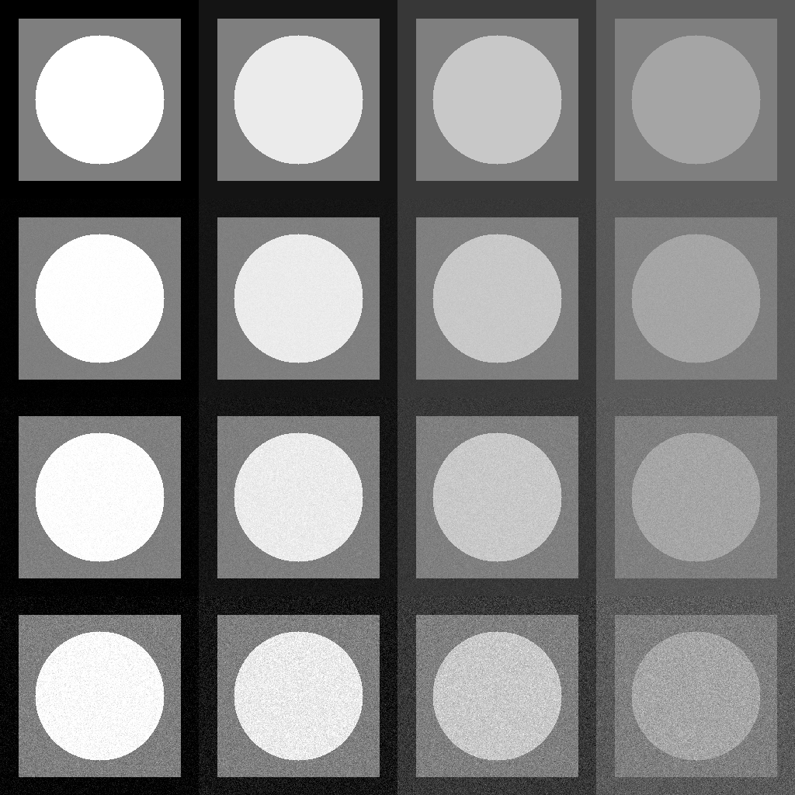
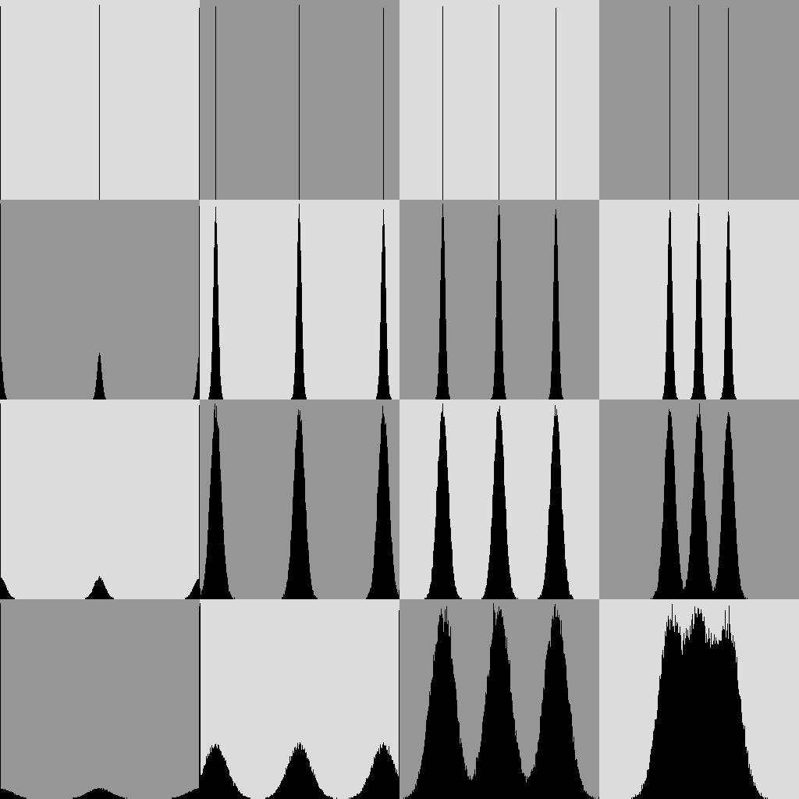

## Отчет по Задаче 1

`task02.cpp` (тагрет `task02`) принимает на вход путь до выходного изображения с шумами и, опционально, путь до выходного изображения гистограмм.
`distribution_params.cpp` (тагрет `task02_distr_params`) отрисовывает markdown таблички со статистиками по каждому элементу изображения (фон, квадрат, круг) для каждого уровня яркости и среднеквадратичного отклонения шума.

### Коллаж с разными вариантами яркостей/шума 

### Гистограммы яркостей

Была написана функция для построения гистограммы изображения - `semcv::draw_histo`.
Визуализация:

Все соотносится с теорией:
- Незашумленные изображения выглядят как 3 полоски уровня яркостей.
- Чем меньше контрастность изображения - тем ближе столбцы друг к другу.
- С ростом шума столбцы раздуваются.

### Анализ статистик

С помощью функции `semcv::calc_distribution_params`, были рассчитаны среднее и отклонение для каждого элемента зашумленных изображений (в заданных вариантах).
Ниже приведены таблицы по каждому элементу изображения:

(Среднее; Отклонение) для фона:
| Noise STD | Brightness = 0 | Brightness = 20 | Brightness = 55 | Brightness = 90 |
|----------------|----------------|----------------|----------------|----------------|
| 3 | 1.1903; 1.7753 | 19.9823; 3.0112 | 54.9878; 2.9915 | 90.0086; 3.0381 |
| 7 | 2.7926; 4.0828 | 19.9682; 7.0536 | 54.9537; 6.9994 | 90.0187; 6.9957 |
| 15 | 5.9825; 8.7489 | 20.6429; 13.8875 | 55.0374; 15.0888 | 90.0890; 14.9534 |

(Среднее; Отклонение) для квадрата:
| Noise STD | Brightness = 127 | Brightness = 127 | Brightness = 127 | Brightness = 127 |
|----------------|----------------|----------------|----------------|----------------|
| 3 | 127.0014; 2.9797 | 127.0158; 3.0184 | 127.0070; 3.0146 | 127.0153; 3.0060 |
| 7 | 126.9992; 7.0200 | 126.9994; 6.9671 | 127.0604; 7.0227 | 126.9219; 6.9881 |
| 15 | 127.0428; 15.0904 | 127.1129; 15.0681 | 127.0478; 14.9433 | 126.9016; 15.0364 |

(Среднее; Отклонение) для круга:
| Noise STD | Brightness = 255 | Brightness = 235 | Brightness = 200 | Brightness = 165 |
|----------------|----------------|----------------|----------------|----------------|
| 3 | 253.8119; 1.7501 | 234.9943; 2.9823 | 199.9859; 3.0382 | 164.9760; 2.9817 |
| 7 | 252.1823; 4.1156 | 234.9626; 7.1042 | 199.9346; 7.0735 | 165.0160; 6.9817 |
| 15 | 249.0769; 8.6664 | 234.5121; 13.7894 | 200.0990; 15.0193 | 165.0189; 15.0568 |

Т.к. шум был несмещенным, среднее почти везде соответствует уровню яркости - смещенность для значений яркости близких к граничным значениям (0 или 255), объясняется срезкой значений, вышедших за пределы допустимых, при зашумлении. Значение отклонения же согласованно с отклонением шума, отличия же при Brightness = 0 и 255, опять же объясняются срезкой значений.
