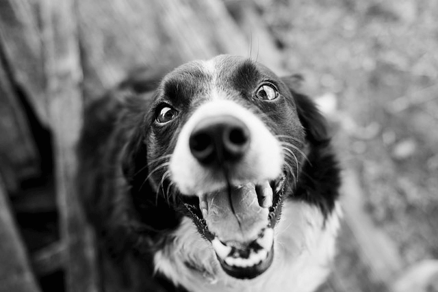
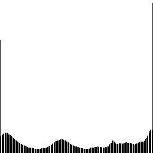

## Отчет

- `task03` - утилита из условия

 - `test_contrast.cpp` (тагрет - `task03_test_contrast`) - запуск обоих вариантов алгоритма и построение гистограмм для данного изображения.
(кладет сгенерированные изображения в папку `testing/`. В названии файлов содержится: вид использованного алгоритма, использованные квантили, является ли изображение гистограммой и для какого канала)

В рамках тестов были использованы следующие изображения (находятся в `testing/originals`):

---

### Серые изображения (функция `autocontrast`)

Описание алгоритма:

- Строится гистограмма яркостей всего изображения.
- Находятся пороговые уровни интенсивности, соответствующие квантилиям q_black (нижний) и q_white (верхний).
- Все значения ниже нижнего обрезаются в 0, выше верхнего — в 255.
= Остальные пиксели линейно масштабируются из диапазона [black_thresh…white_thresh] в полный [0…255], повышая контраст.

Прогонки алгоритма:

|  Квантиль черного | Квантиль белого | Результат | Гистограмма |
|---|---|---|---|
| Исходное изображение | - |  |                 |
| 0.05 | 0.95 |  |                 |
| 0.2 | 0.8 |  |  |
| 0.05 | 0.7 |  |  |
| 0.3 | 0.95 |  |  |

Заметим, что у исходного изображения распределение яркостей было примерно равномерным между всеми значениями. При автоконтрастировании большая часть пикселей становится белыми/черными. Изменение квантилей (увеличение q_black и уменьшение q_white) ведет к увеличению числа соответствующих пикселей.

---

### Цветные изображения (наивный подход)

Пример хорошего результата:

|  Квантиль черного | Квантиль белого | Результат | Гистограмма (для зеленого цвета) |
|---|---|---|---|
| Исходное изображение | - |  |                 |
| 0.05 | 0.95 |  |                 |

В результате получили контрастную картинку, без "негативных эффектов"

Примеры плохих результатов:

|  Квантиль черного | Квантиль белого | Результат | Гистограмма (для синего цвета) |
|---|---|---|---|
| Исходное изображение | - |  |                 |
| 0.05 | 0.95 |  |                 |

(при автоконтрастировании исходного изображения появилось слишком много синего цвета)   

|  Квантиль черного | Квантиль белого | Результат | Гистограмма (для красного цвета) |
|---|---|---|---|
| Исходное изображение | - |  |                 |
| 0.05 | 0.95 |  |                 |

(т.к. красного было мало, то после контрастирования его стало слишком много)   

---

### Ограниченное автоконтрастирование цветных изображений

Принцип работы функции:

- Собирается общая гистограмма всех трёх каналов (B, G, R) вместе.
-  По квантилиям q_black/q_white из этой объединённой гистограммы вычисляются единые пороги чёрного и белого.
- Для каждого канала отдельно применяют линейное растяжение: всё ниже нижнего порога → 0, выше верхнего → 255, а значения между → линейно в [0…255].
- В результате сохраняется цветовой баланс, а контраст усиливается согласовано по всем каналам.

Примеры:

| Алгоритм |  Квантиль черного | Квантиль белого | Результат | Гистограмма (для синего цвета) |
|---|---|---|---|---|
| Исходное изображение | - | - |  |                 |
| Наивный | 0.05 | 0.95 |  |                 |
| RGB | 0.05 | 0.95 |  |                 |

(можно заметить, что результат немного улучшился - меньше "лишнего" синего)   

| Алгоритм |  Квантиль черного | Квантиль белого | Результат | Гистограмма (для синего цвета) |
|---|---|---|---|---|
| Исходное изображение | - | - |  |                 |
| Наивный | 0.05 | 0.95 |  |                 |
| RGB | 0.05 | 0.95 |  |                 |

(Стало заметно лучше, при этом улучшилась и контрастность исходной картинки)   

| Алгоритм |  Квантиль черного | Квантиль белого | Результат | Гистограмма (для красного цвета) |
|---|---|---|---|---|
| Исходное изображение | - | - |  |                 |
| Наивный | 0.1 | 0.9 |  |                 |
| RGB | 0.1 | 0.9 |  |                 |

Из гистограмм заметно, что RGB подход лучше наивного учтитывает баланс цветов цветов
