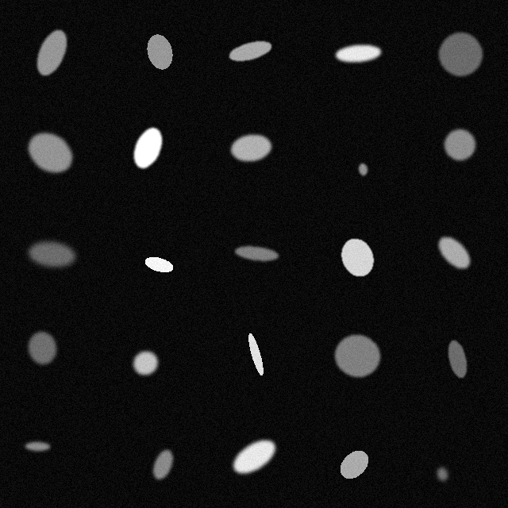
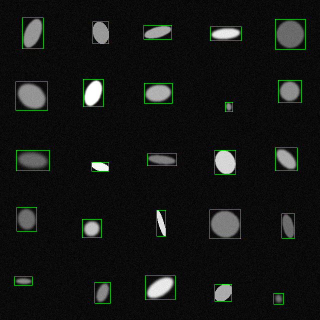
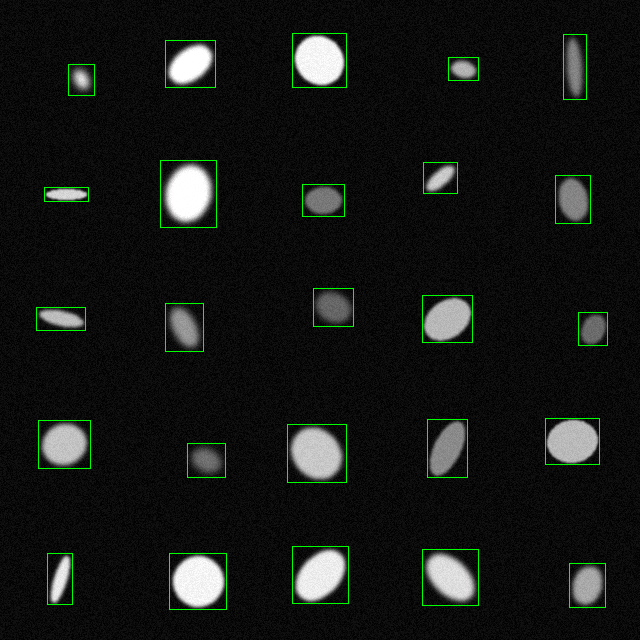
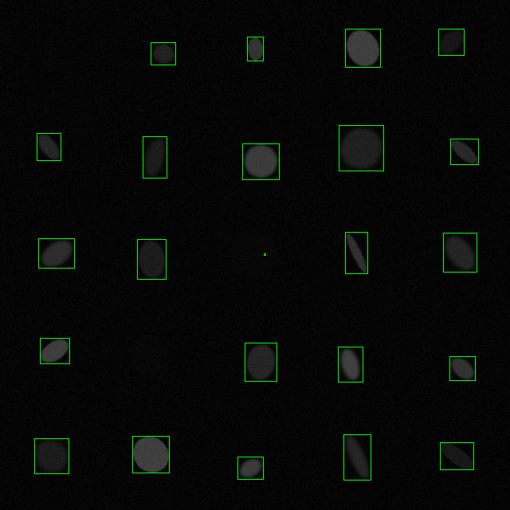
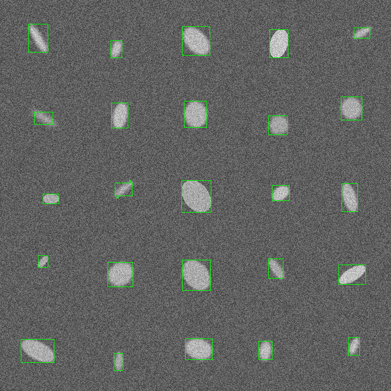

### Отчет по Задаче 4
---
### task04_01

Была написана функция для генерации тестового изображения - `semcv::generate_ellipse_grid`. Конфиг для приложения выглядит следующим образом (умолчательный конфиг лежит в `generator_config.json`):
- `cell_size`, `cell_margin` - размер и отступ одной клетки
- `grid_size` - размер сетки из клеток (будет сгенерировано изображение из `grid_size` x `grid_size` клеток)
- `noise_low`, `noise_high` - диапазон значений фонового шума
- `blur_mean`, `blur_std` - параметры размытия эллипсов 
- Параметры самих эллипсов (`ellipse`): `axis_low`, `axis_high` - диапазон размеров осей; `intensity_low`, `intensity_high` - диапазон интенсивности эллипса (для каждого эллипса будет выбрано случайное значение из заданного диапазона)
- `seed` - значение seed для генератора случайных чисел (можно переопределить с аргументами приложения)


#### Пример генерации

Изображение:



GroundTruth-разметка записывается в .txt файл (см data/*_truth.txt)

---
### task04_02

Был реализован алгоритм детекции (semcv::find_ellipses)

Описание алгоритм:
- Исходное изображение переводится в чёрно-белый формат (0/255) с помощью порогового значения
- Формируется структурный элемент: cоздаётся эллиптическое ядро размером `kernel_size`×`kernel_size` с помощью `cv::getStructuringElement`
- Морфологическая фильтрация (`cv::morphologyEx`): Сначала выполняется операция `cv::MORPH_OPEN`, которая удаляет мелкие шумовые участки. Затем выполняется `cv::MORPH_CLOSE`, что заполняет небольшие чёрные пробелы внутри белых областей. В итоге остаются более чистые, сплошные формы, напоминающие эллипсы.
- Поиск компонент связности c помощью `cv::connectedComponentsWithStats`
- Для каждой найденной компоненты формируется `bounding box`

Пример результата детекции:



---
### task04_03

Генерируется отчет, содержащий следующие метрики (для каждой пары Prediction и Ground Truth): `Intersection over Union`, `Precision`, `Recall`. Примерный вывод выглядит следующим образом (см. `data/report.txt`):
```
Evaluating:
  Truths: /home/user/development/mipt2025s-4-konev-s-a/task04/data/1_pred.txt
  Predictions: /home/user/development/mipt2025s-4-konev-s-a/task04/data/1_truth.txt
  Detections: 25, GroundTruths: 25
  Mean IoU:   0.752616
  Precision:  0.96
  Recall:     0.96
```

---
### Анализ

Были сгенерированы следующие изображения: 20 "простых для детекции" (см. конфиг `data/default.json`), 10 изображений с низким контрастом объект/фон (см. конфиг `data/low_contrast_config.json`), 10 изображений с большим уровнем шума (см. конфиг `noised_config.json`). `run_generator.sh` - скрипт, запускающий процесс генерации. Сгенерированные изображения лежат в `data/` с именами  вида `N.png`, Ground Truth для них - `N_truth.txt`.\
Затем был запущен детектор на данных изображениях (скрипт - `run_detector.sh`). Результаты детекции также лежат в `data/` с именами: `N_pred.png` - изображение с выбранной детектором разметкой, `N_pred.txt` - сама разметка.\
Также был сгенерирован отчет с помощью `task04_03` (см. `data/report.txt`).

### "Простой" случай

Для простых изображений алгоритм справляется эффективно. Ниже приведен пример и значения метрик из отчета



```
Evaluating:
  Truths: /home/user/development/mipt2025s-4-konev-s-a/task04/data/5_pred.txt
  Predictions: /home/user/development/mipt2025s-4-konev-s-a/task04/data/5_truth.txt
  Detections: 25, GroundTruths: 25
  Mean IoU:   0.679308
  Precision:  0.96
  Recall:     0.96
```

Относительно низкое значение IoU объясняется размытием эллипсов, что приводит к большим размерам bounding box

### Низкий контраст

При очень низком контрасте с фоном алгоритм может справляться хуже



```
Evaluating:
  Truths: /home/user/development/mipt2025s-4-konev-s-a/task04/data/21_pred.txt
  Predictions: /home/user/development/mipt2025s-4-konev-s-a/task04/data/21_truth.txt
  Detections: 25, GroundTruths: 23
  Mean IoU:   0.699893
  Precision:  0.88
  Recall:     0.956522
```

Тут мы видим, что алгоритм не нашел объект на 4 ряде, 2 столбец. Также выделил шум на 3 ряде, 3 столбце, вместо всего эллипса. С этими проблемами можно бороться более "тонким" подбором значения порога для бинаризации.

### Большой шум

Зашумленные изображения также могут создавать проблемы для работы алгоритма



Видим, что алгоритм может также выделять высокий шум как объект (3 ряд, 2 столбец). Также может слишком сильно поджимать bounding box, обрезая границы объекта, т.к. объект начинает сливаться с шумным фоном (2 ряд, 1 столбец)

