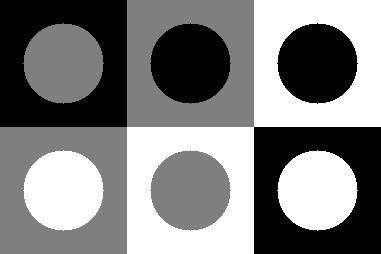
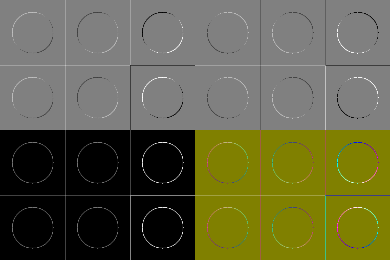

### Отчет по Задаче 5
---
Были написаны следующие функции:
- `semcv::create_squares_with_circles_image` - генерирует тестовое изображение. Результат работы (`test_image.png`):

- `semcv::apply_filters_and_create_collage` - применяет к изображению описанные в условии преобразования и составляет из них коллаж. В частности:
1) Создает результаты фильтрации $I_1$ и $I_2$ с помощью `cv::filter2D`
2) Создает $I_3$ из $I_1$ и $I_2$ с помощью `cv::magnitude`
3) Создает RGB изображение $V_4$

Полученный коллаж (`collage.png`):

---
# Анализ

Фильтр $M_1$

Выделяет изменения интенсивности по диагонали (верхний левый → нижний правый). Тем самым выделяются края с изменением интенсивности в этом направлении.
(Светлый контур при увеличении яркости в этом направлении, иначе темный).

---

Фильтр $M_2$

Аналогично, выделяет изменения яркости, но вниз вдоль побочной диагонали изображения (верхний правый → нижний левый). В результате чего, например, черные круги имеют черный контур сверху справа, и белый снизу слева.

---

$I_3 = \sqrt{I_1^2 + I_2^2}$

Объединяет результаты фильтров, показывая изменение интенсивности вне зависимости от направления, что делает все границы яркими. Причем интенсивность контура зависит от того, насколько сильный перепад яркостей на границе (самые яркие - переходы между белым и черным. Переходы с серыми зонами уже тусклее).

---

Изображение $V_4$

Цветное изображение отражает как величину градиента, так и его ориентацию:
- Синяя компонента отвечает за величину изменения (берется из $I_3$). Так, например, горизонтальная граница между белым и черным квадратом синяя.
- Красный выделяет края, где доминирует 1ый фильтр.
- Зеленый - где доминирует 2ой фильтр.
