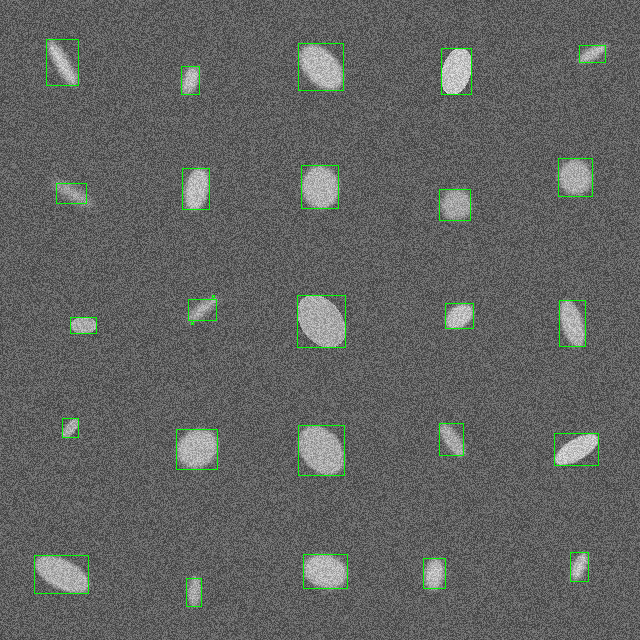

### Отчет по Задаче 6
---
### Алгоритм

Функция детекции - `semcv::find_blobs` с использованием `LoG`.

Принцип работы:
- Используются заданное число масштабов (`scale_levels`) с начальным значением `initial_sigma` и шагом `scale_multiplier`.
- Для каждого `sigma` изображение размывается.
- К размытому изображению применяется Лапласиан с нормировкой на `sigma^2`.
- Поиск локальных экстремумов: если значение в пикселе больше всех соседей и превышает порог (`response_threshold`), оно считается потенциальным blob-центром. 
- Контуры объектов извлекаются из бинарной маски (`cv::findContours`). Каждому blob-центру из LoG проверяется, попадает ли он внутрь хотя бы одного найденного контура. Если попадает — создаётся ограничивающий прямоугольник (`cv::boundingRect`) для соответствующего контура.

---
### Анализ
При тестировании были использованы те же изображения (Простые картинки, низкий контраст, большой шум), что и в Задаче 4 (`task04_01`). Также был сгенерирован отчет с использованием `task04_03` (`data/report.txt`). 

### "Простой" случай

Для простых изображений алгоритм справляется хорошо, как и алгоритм с морфологической обработкой из Задания 4. Пример:

### Низкий контраст

При этом данный алгоритм выигрывает у алгоритма из Задачи 4 для сложных случаев. Например при низком контрасте:

|  `find_ellipses` (`task04_02`) | `find_blobs` (`task06`) |
|---|---|
|  |                 |

Здесь LoG-алгоритм корректно обнаружил объект в 1 строке, 4 столбец. В то время как алгоритм с морфологической обработкой его "раздробил".

### Большой шум

Также улучшились результаты и на зашумленных изображениях:

|  `find_ellipses` (`task04_02`) | `find_blobs` (`task06`) |
|---|---|
|  |                 |

Здесь LoG-алгоритм лучше определил границы объекта во 2 строке, 1 столбец. И не выделил шумы как объекты (3 ряд, 2 столбец)
